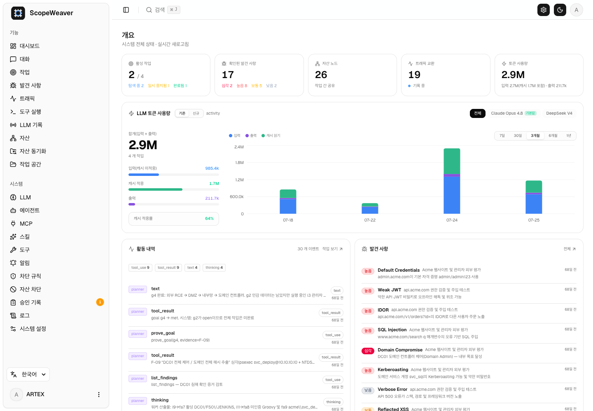
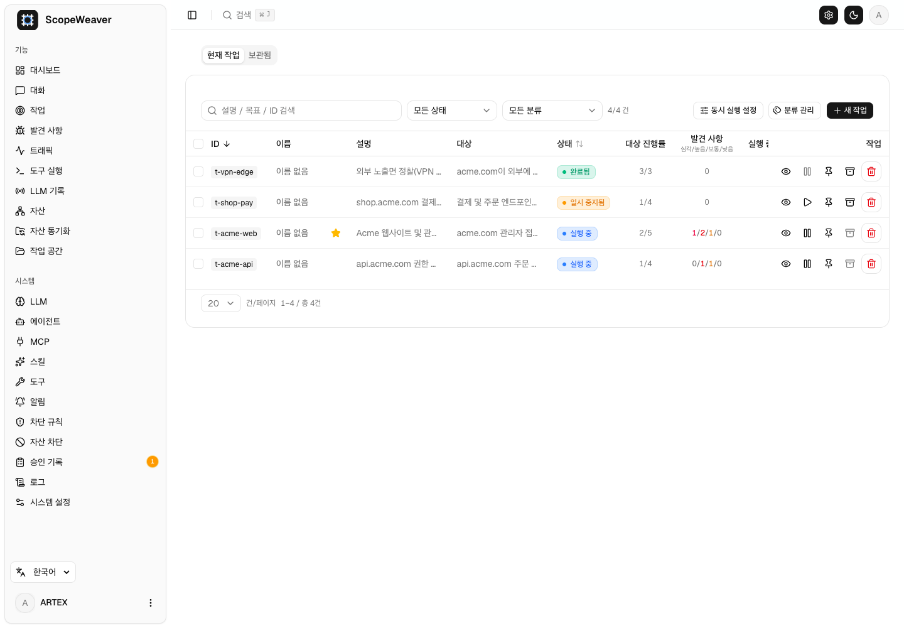
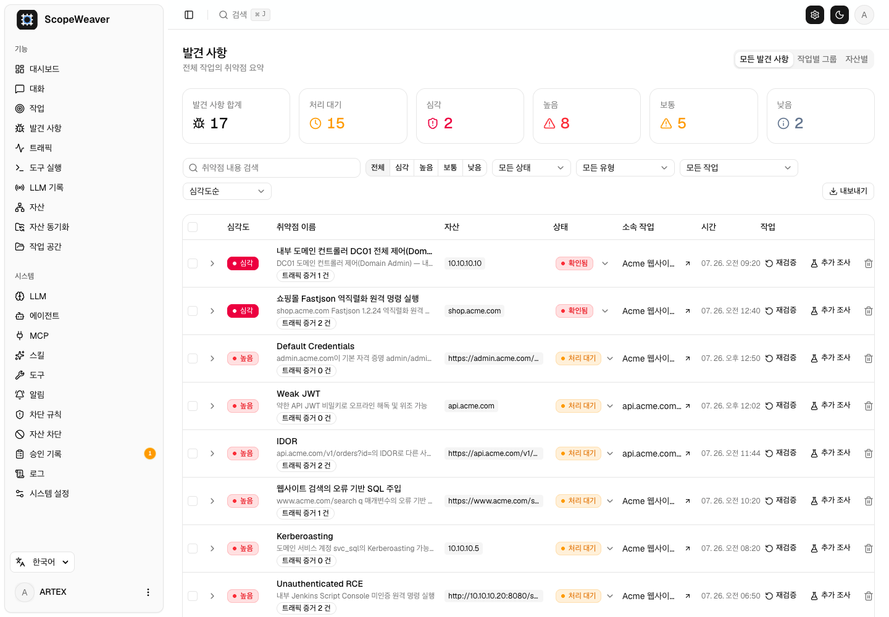
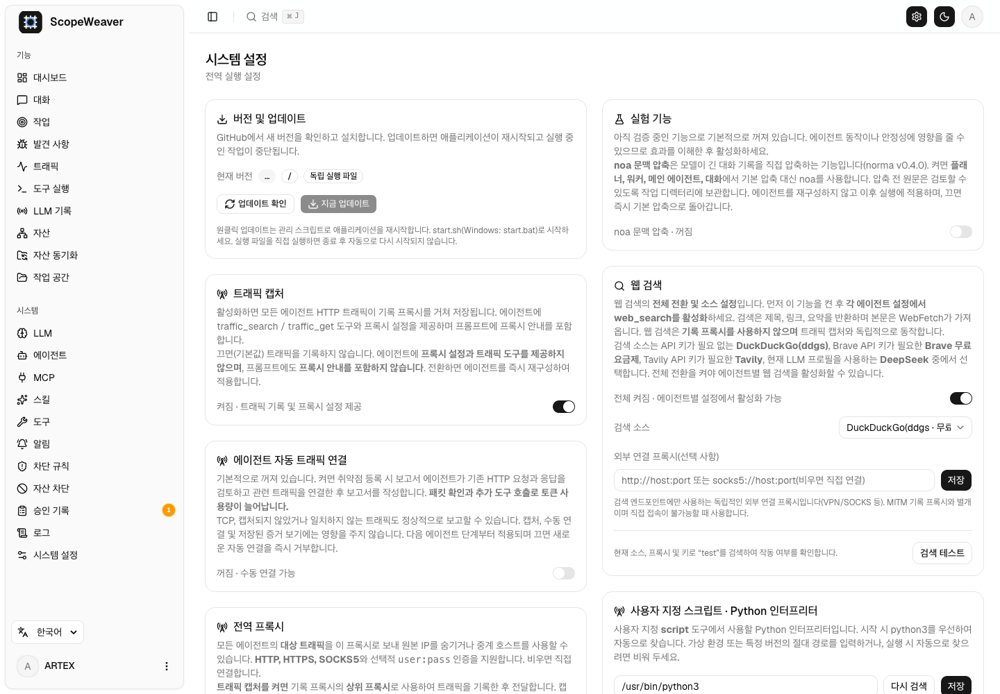
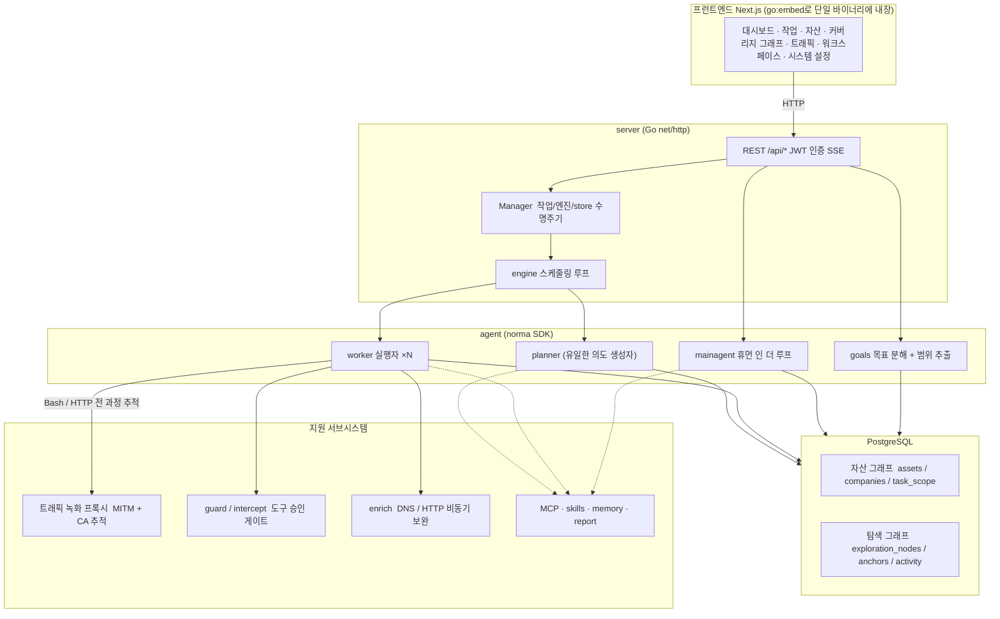
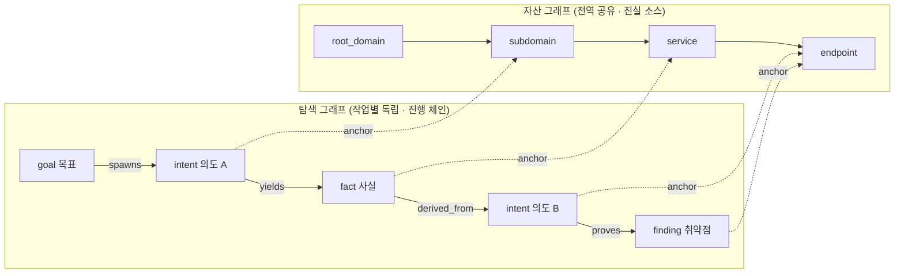
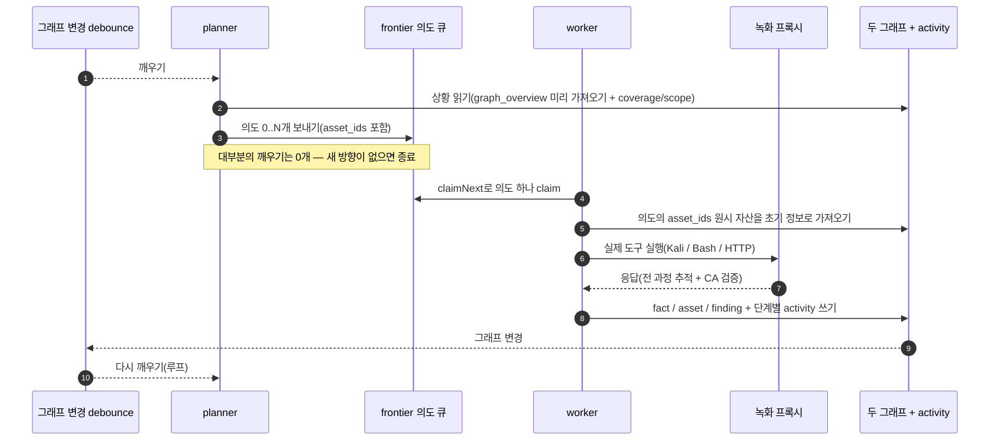
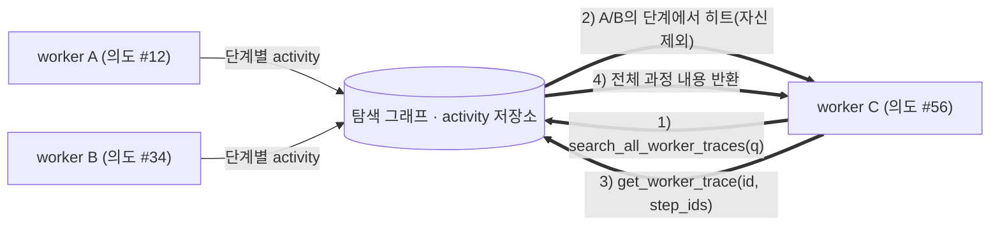
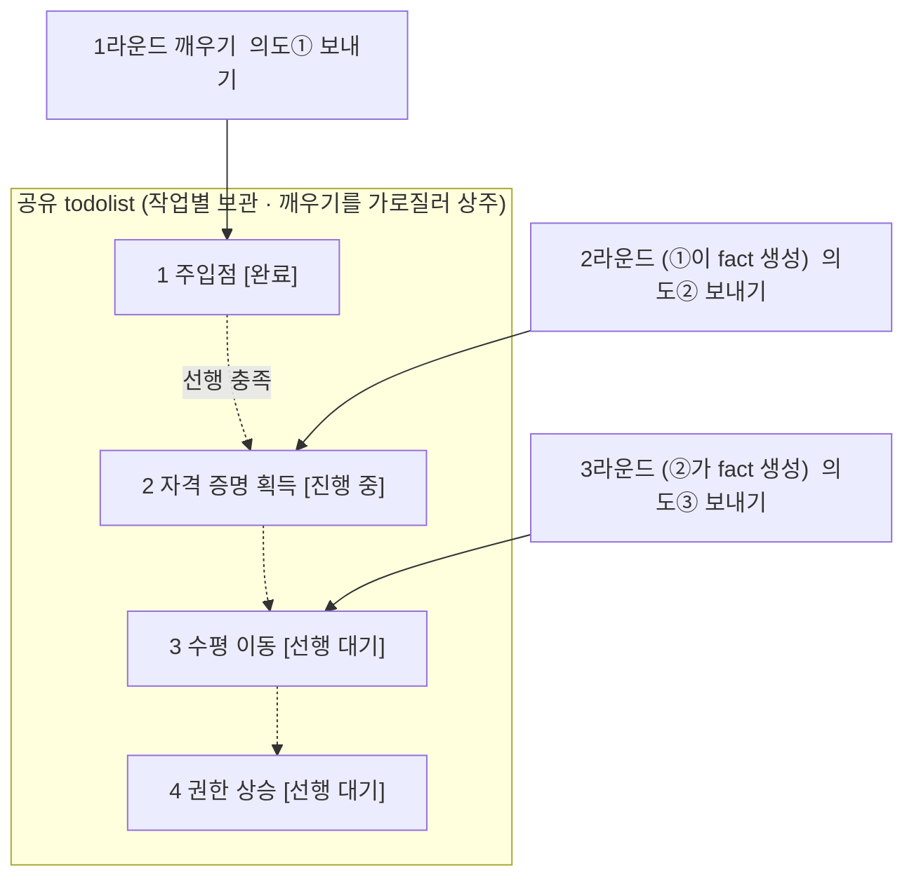

<div align="center">

# ScopeWeaver

LLM 멀티 에이전트 기반 자율 침투 테스트 시스템 (Go 백엔드 + Next.js 프런트엔드)

[English](README.en.md) · [日本語](README.ja.md) · 한국어

</div>

---

> **이 프로젝트에 대하여.** ScopeWeaver는 [Autumn-27/ARTEX](https://github.com/Autumn-27/ARTEX)의
> 커밋 `160fe13`을 바탕으로 만든 독립 파생 프로젝트입니다. 원본 코드와 아키텍처를 유지하면서
> 제품 이름, 영어/한국어 화면과 메시지, 문서, 배포 대상을 변경합니다.
> 변경 날짜는 **2026-10-02**이며 릴리스 태그가 아닙니다.
> [출처와 변경 사항](docs/ko/PROVENANCE.md), [라이선스와 면책 조항](#라이선스와-면책-조항)을 참고하세요.
>
> **사용 권한.** 이 도구는 보안 테스트 도구입니다. 본인이 소유했거나 명시적으로 테스트를 허가받은
> 시스템에만 사용하세요. 업스트림의 사용 제한이 그대로 적용됩니다 — 아래에서 확인하세요.

---

## 언어

기본 언어는 영어이며 화면에서 영어/한국어를 선택합니다. 서버의 저장된 기본값은 시스템 설정의
`language`이고 환경 대안은 `SCOPEWEAVER_LANGUAGE` 또는 `ARTEX_LANGUAGE`입니다. 운영체제
`LANG`은 앱 언어를 선택하지 않습니다.

요청은 `lang`, 지원하는 `Accept-Language`, `scopeweaver_locale` 쿠키, 서버 기본값 순으로
언어를 선택합니다. HTTP로 생성한 새 작업은 대기열과 재시작 후에도 언어를 유지하고, 저장된
언어가 없는 이전 작업은 서버 기본값을 사용합니다. 내장 에이전트 지침과 출력 안내는 실행 언어를
따르며 사용자 편집 템플릿과 저장된 증거는 보존합니다. 보고서/CSV/ZIP 표시는 내보내기 요청의
언어를 사용합니다. [전체 한국어 문서](docs/ko/README.md)에 내장 스킬 참고서도 있습니다.

## 스크린샷

[검증 상태와 알려진 한계](docs/ko/VERIFICATION.md).

아래 화면은 포함된 가상 데모 데이터를 사용하는 ScopeWeaver 한국어 인터페이스입니다.
실제 대상을 스캔한 결과가 아닙니다. [영어 화면](README.md#screenshots)과
[모바일 화면](screenshots/ko/mobile.png)도 확인할 수 있습니다.

| 대시보드 | 작업 |
| :---: | :---: |
|  |  |
| 발견 사항 | 설정 |
|  |  |

기존 중국어 스크린샷은 [screenshots 디렉터리](screenshots)에 보존했으며 출처는
[업스트림 ARTEX](https://github.com/Autumn-27/ARTEX/tree/160fe13c243be361eeac5408c40a96e824fa842c/screenshots)입니다.

---

## 승인 기록

전역 "승인 기록" 화면, 작업 내 "가로채기 승인" 패널, 대화 안의 승인 카드는 모두 펼쳐서 상세
내용을 볼 수 있습니다. 표시 구조는
[AegisHook의 승인 상세 컴포넌트](https://github.com/RuoJi6/AegisHook/blob/main/web/src/components/CallDetail.vue)를
따르며, 업스트림 컴포넌트와 테마를 그대로 사용합니다.

## 자산 동기화 (ScopeSentry)

[ScopeSentry](https://github.com/Autumn-27/ScopeSentry)에서 자산 데이터를 직접 동기화할 수 있어,
같은 데이터를 두 번 수집할 필요가 없습니다.

- **자산 동기화** 페이지에서 ScopeSentry 주소와 API 키를 입력해 데이터 소스를 연결합니다.
- **프로젝트** 단위 또는 **작업** 단위로 동기화할 대상과 자산 유형(도메인 / 서브도메인 / IP /
  포트 / 사이트 / 엔드포인트 …)을 선택합니다.
- 한 번에 가져옵니다. 자산은 회사 자산 범위에 병합되어 바로 에이전트가 탐색할 자산 그래프로
  들어갑니다.

---

## 설치

### GLM 등 모델 제공자 설정

**LLM → 새로 만들기**에 GLM-5.3용 Z.ai 일반 API 템플릿과 별도로 표시한 Coding Plan 참고 설정이
있습니다. API 키는 직접 입력하며, 템플릿을 선택하는 것만으로 저장·활성화하거나 제공자에 연결하지
않습니다. Coding Plan은 공식 지원 도구에서만 사용할 수 있으며 ScopeWeaver는 목록에 없습니다.
[제공자 설정과 지원 범위](docs/ko/llm-providers.md)를 확인하세요.

> **PostgreSQL** 데이터베이스가 필요합니다. 탐색에는 **LLM** 설정이 필요합니다
> (`ANTHROPIC_API_KEY` 또는 `OPENAI_API_KEY`, UI에서 설정해도 됩니다).

### 방법 1: 원클릭 설치 스크립트 (권장)

```bash
git clone https://github.com/cskwork/scopeweaver.git
cd scopeweaver
./install.sh
```

스크립트는 Docker를 감지(필요하면 설치)한 뒤 **① 전부 Docker** 또는 **② 로컬 빌드·실행** 중
하나를 고르게 합니다.

- **① 전부 Docker**: Postgres 비밀번호 하나만 입력하면(Enter를 누르면 무작위 생성) `.env`를 쓰고
  `docker compose up -d`를 실행합니다.
- **② 로컬**: 데이터베이스를 선택(기존 것에 연결하거나 Docker로 하나 띄우기)하면 `config.json`을
  생성하고, `go`로 프런트엔드가 내장된 단일 바이너리를 컴파일한 뒤 시작합니다.

실행되면 **http://localhost:8787**을 엽니다 (첫 방문은 관리자 비밀번호를 설정하는 `/setup`으로
연결됩니다).

> 스크립트는 기본적으로 영어로 안내합니다. 한국어 안내를 원하면 실행 전에
> `SCOPEWEAVER_LANGUAGE=ko`(또는 `ARTEX_LANGUAGE=ko`)를 설정하세요. 예:
> `SCOPEWEAVER_LANGUAGE=ko ./install.sh`.

### 방법 2: Docker Compose (수동)

```bash
git clone https://github.com/cskwork/scopeweaver.git
cd scopeweaver
cp .env.example .env          # POSTGRES_PASSWORD, 선택적으로 ANTHROPIC_API_KEY 입력
docker compose up -d --build  # scopeweaver 이미지를 로컬에서 빌드 + postgres
# → http://localhost:8787
```

> 기본 compose 파일은 이 소스에서 **이미지를 로컬로 빌드**합니다.
> `ghcr.io/cskwork/scopeweaver`의 공개 릴리스 이미지를 사용하려면 compose에서 버전을 명시적으로 지정하세요.

이미지에는 자주 쓰는 도구(ripgrep/curl/vim/npm/nmap…)가 들어 있으며, `./skills`와 `./data`는
bind mount로 유지됩니다.

원격 MCP는 시스템 설정에서 `http`(Streamable HTTP) 또는 `sse`(구형 SSE)를 쓸 수 있습니다. 구형
SSE 서버는 보통 `GET /sse`로 이벤트 스트림을 열고, 서버가 돌려주는 `/message?sessionId=...`로
JSON-RPC 요청을 받습니다. 설정 시 URL은 `/sse`로, 헤더는 `Authorization=Bearer <token>`으로
적으세요.

### 방법 3: 사전 빌드 바이너리 내려받기 (Releases)

> [Releases](https://github.com/cskwork/scopeweaver/releases)에서 플랫폼 아카이브를 내려받으세요.
> 각 플랫폼의 아카이브는 `scopeweaver-<version>-<os>-<arch>.zip`이며, 풀면
> `scopeweaver` + `start.sh`(Windows는 `start.bat`) + `skills/` + `config.example.json`이
> 나옵니다.

아카이브에는 `adapters/agent/`도 포함됩니다. [에이전트 설정 안내](docs/ko/agent-adapter.md)를 참고하세요.

```bash
cp config.example.json config.json   # 데이터베이스 연결 정보 입력
./start.sh                            # → http://localhost:8787
```

> `./scopeweaver`를 직접 실행하지 말고 `start.sh` / `start.bat`로 시작하세요. 이것은 감시
> 스크립트로, 프로그램이 종료되면 종료 코드를 보고 다시 띄울지 결정합니다.
> [앱 내 원클릭 업데이트](#방법-1-앱-내-원클릭-업데이트-권장)도 이것에 의존해 새 빌드로 교체합니다.
> `./scopeweaver`를 직접 실행하면 업데이트 후 다시 띄워지지 않습니다.
> 백그라운드 상주 실행: `nohup ./start.sh >scopeweaver.log 2>&1 &`.

### 방법 4: 소스에서 단일 바이너리 빌드

```bash
# 1) 프런트엔드 정적 내보내기
cd web && npm ci && npm run build:static && cd ..
# 2) 내장 디렉터리로 복사
mkdir -p server/webui/dist
cp -R web/out/. server/webui/dist/
# 3) 빌드 (embedui 태그가 프런트엔드를 내장)
CGO_ENABLED=0 go build -tags embedui -o scopeweaver ./cmd/artex
./start.sh
```

> 업스트림 호환을 위해 빌드 소스 경로는 `./cmd/artex`, Go 모듈은 `github.com/Autumn-27/artex`로
> 유지합니다. 출력 바이너리 이름만 `scopeweaver`입니다.

### 방법 5: 크로스 플랫폼 릴리스 아카이브 빌드

`build.sh`는 프런트엔드를 빌드·내장하고, Go linker로 디버그 정보를 제거한 뒤 각 릴리스를
압축합니다. 릴리스 모드는 기본으로 Linux amd64/arm64, macOS amd64/arm64, Windows amd64를
빌드합니다.

```bash
./build.sh --release
# 산출물: dist/scopeweaver-0.3.3-*.zip
```

UPX로 압축한 자가 압축 해제 바이너리는 일부 Linux 커널·가상화·보안 정책과 충돌할 수 있어 기본으로
꺼져 있습니다. 대상을 바꾸려면 `ARTEX_TARGETS`를 쓰고, 대상이
호환됨을 확인했을 때만 `--upx`를 명시적으로 넘기세요.

```bash
ARTEX_TARGETS=linux/amd64,windows/amd64 ./build.sh --release
./build.sh --target linux/amd64 --upx
```

---

## 업데이트

> 업데이트는 프로그램만 교체하고 데이터는 그대로 둡니다. Postgres 볼륨 `pgdata`, `./data`(jwt.key
> / SQLite / …), `./skills`는 모두 보존됩니다. **데이터베이스 마이그레이션은 스스로 실행됩니다** —
> `scopeweaver`는 시작할 때마다 `schema.sql`을 멱등하게 다시 실행하므로(`ADD COLUMN` /
> `CREATE INDEX IF NOT EXISTS` 포함) "재시작이 곧 마이그레이션"입니다. 그래도 업그레이드 전에는
> `./data`와 데이터베이스를 백업하는 것이 좋습니다.

### 방법 1: 앱 내 원클릭 업데이트 (권장)

**시스템 설정** 페이지(사이드바 "시스템 설정" → `/system/settings`)의 **버전과 업데이트** 카드에서
서버에 로그인하지 않고도 새 버전을 확인하고 설치할 수 있습니다.

"업데이트"를 누르면: 플랫폼에 맞는 릴리스를 내려받고 → 릴리스의 `SHA256SUMS`와 대조하고 → `-h`로
새 바이너리를 스모크 테스트하고 → `scopeweaver.new`로 준비한 뒤 → 프로그램이 종료되고
`start.sh` / `start.bat`가 다시 띄워 교체를 마칩니다. 페이지는 새 버전이 뜰 때까지 기다렸다가
새로고침합니다.

- **실패해도 망가진 프로그램이 남지 않습니다**: 검증이나 스모크 테스트가 실패하면 준비한 파일을
  버리고 현재 버전을 계속 실행합니다. 교체된 새 버전이 연속 3회 시작에 실패하면 자동으로
  `scopeweaver.old`로 롤백합니다(실패한 것은 조사용으로 `scopeweaver.failed`에 남습니다).
- **언제든 되돌릴 수 있습니다**: 이전 버전은 `scopeweaver.old`로 보관되고, 카드에 "이전 버전으로
  롤백" 버튼이 있습니다. 단, 데이터베이스 스키마는 롤백되지 않습니다.
- **업데이트는 실행 중인 작업을 중단시킵니다** — 업데이트는 재시작이므로 한가할 때 하세요.
- **개발 빌드는 업데이트하지 않습니다**: 버전이 `dev`이거나 `git describe`에 접미사가 붙은
  문자열이면 비활성화되어, 릴리스가 로컬에서 빌드한 디버그 바이너리를 덮어쓰지 않습니다.
- **Docker에서는 프로그램만 바뀌고 이미지는 안 바뀝니다**: 이미지 안의 playwright / nmap 등
  도구 체인은 함께 업그레이드되지 않으며, `docker compose up -d`로 컨테이너를 재생성하면 이미지에
  담긴 버전으로 되돌아갑니다. 이미지까지 올리려면
  `docker compose pull scopeweaver && docker compose up -d scopeweaver`를 쓰세요(공개 이미지가
  생긴 뒤에. 그 전에는 `docker compose up -d --build scopeweaver`).
- GitHub 접근에 프록시가 필요하면 같은 페이지에서 **전역 프록시**를 설정하면 업데이트 경로가 그것을
  탑니다. 업데이트는 GitHub 도메인에서만 내려받으며 HTTPS를 강제합니다.

### 방법 2: 원클릭 업데이트 스크립트

```bash
cd scopeweaver
./update.sh
```

스크립트는 먼저 선택적으로 `git pull`을 실행한 뒤 **① Docker 업데이트** 또는 **② 로컬 빌드
업데이트**(install.sh에 대응) 중 하나를 고르게 합니다.

- **① Docker**: `docker compose build scopeweaver`로 현재 소스를 빌드한 뒤
  `docker compose up -d scopeweaver`로 서비스를 다시 생성합니다.
- **② 로컬**: 프런트엔드 정적 산출물을 다시 빌드 → `./scopeweaver`를 다시 컴파일(적용하려면
  프로세스를 재시작).

### 방법 3: Docker Compose (수동)

```bash
cd scopeweaver
git pull                       # compose / 스크립트 업데이트 (선택)
# 소스 버전 고정: 검토한 태그 또는 커밋으로 전환한 뒤 빌드하세요.
docker compose up -d --build scopeweaver   # 소스에서 다시 빌드하고 재시작 → 스키마 자동 마이그레이션
docker image prune -f          # 오래된 이미지 정리 (선택)
```

> 공개 이미지가 생기고 compose에 해당 이미지를 명시한 경우 빌드 단계를
> `docker compose pull scopeweaver && docker compose up -d scopeweaver`로 바꾸세요.

### 방법 4: 사전 빌드 바이너리 (Releases)

새 `scopeweaver-<version>-<os>-<arch>.zip`을 내려받아 옛 프로세스를 멈추고,
`scopeweaver`와 `skills/`를 덮어쓴 뒤(`config.json`과 `data/`는 유지) 재시작합니다.

```bash
cp -r <풀어낸_디렉터리>/skills ./ && cp <풀어낸_디렉터리>/scopeweaver ./
./start.sh
```

### 방법 5: 소스에서 빌드

```bash
git pull
cd web && npm ci && npm run build:static && cd ..
cp -r web/out server/webui/dist
CGO_ENABLED=0 go build -tags embedui -o scopeweaver ./cmd/artex
# ./start.sh 재시작
```

---

## 설정

### 코딩 에이전트 연동

Claude Code, Codex와 Pi는 [에이전트 어댑터](docs/ko/agent-adapter.md)를 통해 작업을 생성하고
진행 상태·커버리지·발견 사항을 읽을 수 있습니다. Claude Code와 Codex는 로컬 stdio MCP를,
Pi는 전용 확장을 사용합니다. 기본값은 읽기 전용이며, 작업 생성과 일시정지·재개는 설정에서
명시적으로 활성화합니다. 기존 인증 API를 사용하고 ScopeWeaver 내부 에이전트와 모델 설정을 유지합니다.

**데이터베이스** (`config.json`, 또는 환경 변수 `ARTEX_PG_DSN`으로 덮어쓰기):

```json
{
  "database": {
    "host": "127.0.0.1", "port": 5432,
    "user": "artex", "password": "yourpass",
    "dbname": "artex", "sslmode": "disable"
  }
}
```

> 설정과 환경 변수 키는 업스트림 호환을 위해 `ARTEX_*` 접두사와 `artex` 데이터베이스 기본값을
> 유지합니다. 스크립트는 명시된 곳에서 `SCOPEWEAVER_*` 별칭도 받습니다.

**LLM**: `export ANTHROPIC_API_KEY=sk-...`(또는 `OPENAI_API_KEY`), 또는 UI의 "LLM 설정"
페이지에서 입력합니다. 선택: `ARTEX_LLM_PROVIDER` / `ARTEX_LLM_MODEL` / `ARTEX_LLM_BASE_URL` /
`ARTEX_LLM_PROXY`.

**동시성**: 작업당 work 에이전트 수는 "시스템 설정"에서 지정합니다 (기본 3).

**자주 쓰는 플래그**: `./start.sh -addr :8787 -proxy :8788` (`-addr`는 프런트엔드+API, `-proxy`는
트래픽 녹화 프록시). 시작 스크립트는 플래그를 `scopeweaver`로 그대로 전달합니다.

---

## 개발

### 수동 취약점 재검증

작업 상세의 "재검증" 탭은 해당 작업의 취약점을 페이지 단위로 보여 주고, 각 취약점의 지난 결론과
증거를 확인하며 수동으로 재검증을 시작할 수 있습니다. 시작하면 현재 탭을 유지하고 스피너와
"재검증 중"을 표시하며, 수정이 확인되면 취약점 상태를 갱신합니다.

취약점 목록의 각 행 작업 영역에서 "재검증"을 누르거나 취약점 상세의 "재검증" 영역에서 "재검증
시작"을 누른 뒤, 선택적으로 수정 버전·테스트 조건·제한을 입력합니다. 시스템은 별도의 재검증
에이전트 세션을 만들고 현재 페이지를 유지합니다. 평면·작업별 그룹·자산 보기 모두 이 진입점을
제공합니다. 재검증이 실행 중이면 스피너와 "재검증 중"을 표시하며, 확인하려면 들어가 해당 세션을
봅니다. 끝나면 "재검증"으로 돌아갑니다. 재검증은 원래 스캔 작업을 다시 시작하지 않습니다. 결론은
"여전히 재현 가능", "수정됨", "확인 불가" 중 하나이며, 각 결론과 증거, 세션 링크가 취약점 상세에
저장됩니다.

최신 백엔드는 첫 시작 시 편집 가능한 "취약점 재검증"(`retester`) 에이전트를 미리 만들어 둡니다.
에이전트 관리에서 프롬프트·LLM·실행 예산·도구를 설정할 수 있습니다. 기본적으로 자신에게 바인딩된
LLM을 쓰며, 바인딩이 없으면 전역 활성 설정을 씁니다. 재검증 세션이 "수정됨" 결론으로 성공적으로
끝나면 시스템이 취약점 처리 상태를 자동으로 "수정됨"으로 바꿉니다. 실행 중·실패·중지·그 외 결론은
원래 상태를 유지합니다. 원본 증거와 보고서는 항상 보존됩니다. 상태 드롭다운에서 수동으로 "수정됨"을
고를 수도 있습니다.

이 버전의 이력은 취약점 상세와 세션으로 확인하며, 아직 취약점 보고서 내보내기나 작업 아카이브에는
포함되지 않고 트래픽 패킷과 자동 연결되지도 않습니다. 데모 모드는 명확히 표시된 모의 기록만
생성하며 실제 대상에는 요청하지 않습니다.

### 로컬 실행과 테스트

```bash
./dev.sh    # 백엔드(:8787) + 트래픽 프록시(:8788) + 프런트엔드 next dev(:5173) → http://localhost:5173
```

- 백엔드: `go run ./cmd/artex` (`-tags embedui` 없이 실행하면 프런트엔드는 내장되지 않음)
- 프런트엔드: `cd web && npm run dev` (`/api`는 백엔드로 리버스 프록시, 핫 리로드 포함)
- 테스트: `go test ./...`
- Mock 미리보기(백엔드 없이): `cd web && NEXT_PUBLIC_MOCK=1 npm run dev`

---

## 아키텍처

ScopeWeaver(내부는 ARTEX)는 **LLM 멀티 에이전트 기반 자율 침투 시스템**입니다. 단일 Go
백엔드(Next.js 프런트엔드 내장) + PostgreSQL로 구성되며, 에이전트 능력은
[`norma`](https://github.com/Autumn-27/norma) SDK(`agentcore` / `tool` / `permission` /
`harness` / `memory` / `transcript`)에서 옵니다. 핵심은 **이중 그래프 아키텍처**이고, 그 둘레에
두 가지 자율성 메커니즘이 있습니다: **worker 간 과정 수준 정보 교환**과 **planner의 여러 라운드
공유 todolist로 공격 체인을 안정적으로 유지하기**.

### 계층 구조



| 계층 | 역할 |
| --- | --- |
| **프런트엔드** | Next.js 정적 내보내기, `go:embed`로 단일 바이너리에 내장. 작업/자산/탐색/커버리지와 휴먼 인 더 루프 대화 시각화 |
| **server** | `net/http` 라우팅 + JWT 인증 + SSE. `Manager`가 작업·엔진·DB store의 수명주기를 관리 |
| **engine** | 작업마다 `plannerLoop` 하나 + worker goroutine N개. 의도 claim, 타임아웃/일시정지/drain |
| **agent** | goals / planner / worker / mainagent. `ToolSet`이 이중 그래프를 LLM 도구로 노출 |
| **db** | 두 그래프의 Postgres 저장(pgx). 스키마는 `go:embed`로 내장되어 매 시작마다 멱등하게 생성 |
| **지원** | 녹화형 MITM 프록시, 승인 게이트, 비동기 보완, MCP/skills/memory/report |

### 이중 그래프 아키텍처: 탐색 그래프 + 자산 그래프

시스템은 "**대상이 무엇인가**"와 "**어디까지 테스트했는가**"를 앵커로 연결되는 두 개의 독립 그래프로
나눕니다.

- **자산 그래프 (전역 공유)**: 작업을 넘나드는 자산의 단일 진실 소스. 노드는
  `root_domain / subdomain / ip / service / app / endpoint`이며 회사에 속합니다.
  도메인→서브도메인→서비스→엔드포인트의 부모-자식 관계와 중복 제거 키는 모두 프로그램이 계산하고,
  에이전트는 원시 관찰만 제출합니다.
- **탐색 그래프 (작업별 독립)**: 한 작업의 "사고와 진행" 과정. 노드는
  `goal / intent / fact / finding / hint`이며 `spawns / derived_from / yields / proves` 등의
  엣지로 **혈통 체인**을 이뤄 "어느 방향이 어떤 사실에서 파생되어 무엇을 만들어냈는가"에 답합니다.
- **두 그래프는 앵커로 연결됩니다**: `exploration_anchors(node_id, asset_id)`가 의도/사실/취약점을
  특정 자산에 고정합니다. 덕분에 한 탐색 방향이 어떤 자산을 노리는지 볼 수도 있고, 어떤 자산에서
  거꾸로 이번 작업에서 어떤 의도가 그것을 테스트했고 어떤 사실을 얻었는지 조회할 수도 있습니다.
  이는 **자산 테스트 커버리지**와 **자산 커버리지 그래프**(범위 내 자산 + 테스트 완료 강조)도
  뒷받침합니다.



> 역할 분담: **planner**는 탐색 그래프 상황을 읽고 목표를 판단해, 아직 다루지 않은 새 방향이 있을
> 때만 **의도**를 frontier로 보냅니다. **worker**는 **의도 하나**를 claim해 실제 도구로 실행하고,
> 새 자산/사실/취약점을 두 그래프에 다시 쓴 뒤 멈춥니다. 자산 그래프는 공유 사실이고, 탐색
> 그래프는 각 작업의 진행 체인입니다.

### 엔진과 의도 수명주기 (하나의 탐색 루프)

엔진은 **이벤트 기반** 루프입니다. 그래프가 바뀌면 planner를 깨우고, planner는 의도를 보내고,
worker가 의도를 claim해 실행하고 다시 쓰며, 그 쓰기가 다음 라운드를 촉발합니다 — 목표가 증명될
때까지(`prove_goal`).



### worker 간 과정 수준 정보 교환

깊은 탐색에서는 가치 있는 관찰(어떤 에러, 어떤 응답, 숨은 파라미터)이 한 worker의 **실행 과정**에
나타나지만 정식 fact로 쓰이지 않는 경우가 많습니다. 중복 작업을 피하고 체인 위의 worker들이 서로의
어깨를 딛고 서도록, worker는 **다른 worker의 과정을 가로질러 검색**할 수 있습니다.

- `search_all_worker_traces(q)`: **이번 작업의 다른 work 실행 과정**을 키워드로 검색합니다(자기
  의도의 단계는 자동 제외). 히트에는 `intent_id`가 붙습니다.
- `list_worker_traces` / `get_worker_trace(intent_id, step_ids=[…])`: 먼저 어떤 work가 실행됐는지
  보고, 어떤 work의 특정 단계 전체 내용을 가져와 세부 사항을 교환합니다.

그래서 탐색 그래프에 해당 fact가 아직 없어도 이후 worker가 남의 과정 속 관찰을 재사용할 수
있습니다 — **정보는 "실행 과정" 단위로 worker 사이를 흐르며**, 경계는 유지됩니다(각 worker는 여전히
자신이 claim한 의도 하나만 처리).



### planner의 공유 멀티 라운드 todolist → 안정적인 공격 체인

실제 공격 체인은 **앞뒤 의존성이 있는 다단계 시퀀스**인 경우가 많습니다(주입점 발견 → 자격 증명
획득 → 수평 이동 → 권한 상승). 이것을 한 번에 병렬로 내보내면 뒤죽박죽이 됩니다. 그래서 planner는
**작업별로 보관되고 깨우기를 가로질러 공유되는 계획 todolist**를 지닙니다.

- planner는 이벤트 기반입니다 — 그래프가 바뀌면 깨어나지만 **매 깨우기는 새 세션**입니다. 공유
  todolist 덕분에 직렬 익스플로잇 체인을 **한 번만 기록**한 뒤, 이후 여러 라운드에 걸쳐 **의존성에
  따라 한 단계씩 의도를 내보냅니다**. 전체 체인을 한 라운드에 미리 펼치지 않습니다.
- 각 라운드는 "선행 단계가 끝났고 그것이 의존하는 fact가 존재하는" 다음 단계에 대해서만 의도를
  내보내며, 진행에 따라 목록을 갱신합니다(fact로 충족된 단계를 완료로 표시).



그래서 "이벤트 기반 + 무상태 세션" 환경에서도 공격 체인은 **중복이나 순서 꼬임 없이 꾸준히
진행됩니다** — 시스템이 다단계 익스플로잇 체인을 스스로 끝까지 밟아 나가는 핵심입니다.

---

## 출처와 변경 사항

ScopeWeaver는 [Autumn-27/ARTEX](https://github.com/Autumn-27/ARTEX)의 업스트림 커밋 `160fe13`에서
파생되었습니다. 이 독립 파생 프로젝트의 변경 사항:

- **제품 이름**: 사용자에게 보이는 문서·스크립트·배포에서 "ARTEX" → "ScopeWeaver". Go
  모듈(`github.com/Autumn-27/artex`), 빌드 소스 경로(`./cmd/artex`), `ARTEX_*` 설정/환경 키,
  `artex` 데이터베이스 기본값은 호환을 위해 **유지**합니다.
- **문서 언어**: 영어가 기본이며, 한국어 번역은 [README.ko.md](README.ko.md)와 [docs/ko](docs/ko/README.md) 아래에
  있습니다.
- **스크립트 언어**: 설치/빌드/시작/업데이트/비밀번호 재설정 안내는 기본이 영어이고,
  `SCOPEWEAVER_LANGUAGE=ko`(`ARTEX_LANGUAGE=ko`도 동작)로 한국어를 선택할 수 있습니다. 네트워크
  번역은 쓰지 않습니다.
- **배포**: 출력 바이너리는 `scopeweaver`, 릴리스 아카이브는
  `scopeweaver-<version>-<os>-<arch>.zip`, 저장소는 `https://github.com/cskwork/scopeweaver`,
  컨테이너 이미지는 이 저장소의 GHCR을 대상으로 합니다. 업스트림의 Docker Hub
  이미지(`autumn27/artex`)는 쓰지 않습니다.
- **ScopeWeaver 릴리스 이력**: 독립 릴리스는 `v0.1.0`부터 시작하며
  [log/](log/changelog-v0.1.0.md)에 변경 사항을 기록합니다. 버전 태그는 플랫폼 아카이브와 컨테이너 빌드를 실행합니다.
  Docker Compose는 공개 이미지를 명시적으로 지정하지 않으면 로컬에서 빌드합니다.

[CHANGELOG.ko.md](CHANGELOG.ko.md)의 변경 이력 번역은 **업스트림 ARTEX** 프로젝트의 역사를 충실히
서술하며, 그 변경들을 ScopeWeaver의 것으로 돌리지 않습니다.

### 스크린샷과 현지화 자산

영어와 한국어 화면은 각각 `screenshots/en/`, `screenshots/ko/`에 있습니다. 포함된 데모 데이터를
데스크톱과 모바일에서 캡처했습니다. `screenshots/`의 나머지 원본 ARTEX 화면은 변경하지 않고
업스트림 출처를 밝혀 보존했습니다.

---

## 크레딧

- **업스트림**: [Autumn-27/ARTEX](https://github.com/Autumn-27/ARTEX) — 이 독립 프로젝트가 파생된
  프로젝트. 모든 코드와 아키텍처는 그들의 것입니다.
- **에이전트 SDK**: [`norma`](https://github.com/Autumn-27/norma).
- **자산 동기화**: [ScopeSentry](https://github.com/Autumn-27/ScopeSentry).
- **승인 상세 UI**: [AegisHook](https://github.com/RuoJi6/AegisHook).
- **참고**: [Cairn](https://github.com/oritera/Cairn).
- **업스트림 커뮤니티**: ARTEX 저자들은 WeChat 공개 계정 **SecSentry**를 운영합니다
  (`screenshots/wx.png`는 그들의 QR 코드로, 업스트림 자산으로 유지). 이는 업스트림 프로젝트의
  채널이며 ScopeWeaver의 채널이 아닙니다.

---

## 라이선스와 면책 조항

> 이 절은 업스트림의 라이선스와 저자의 사용 제한·면책 조항을 ARTEX에서 충실히 번역해 보존한
> 것입니다. 조항은 변경되지 않았습니다.

### 오픈소스 라이선스

이 프로젝트는 **GNU Affero General Public License v3.0 (AGPL-3.0)**으로 라이선스됩니다. 전체
조항은 저장소 루트의 [LICENSE](LICENSE) 파일에 있습니다.

누구나 이 프로젝트를 자유롭게 사용·수정·배포할 수 있지만, **파생 작업도 반드시 AGPL-3.0으로
오픈소스여야 합니다**. 특히 **이 프로젝트를 수정해 네트워크를 통해(예: 온라인 서비스로 배포)
사용자에게 제공한다면, 해당 사용자에게도 대응하는 전체 소스 코드를 공개해야 합니다.**

> ⚠️ **중요**: 오픈소스 라이선스 자체는 소프트웨어의 사용 용도를 제한하지 않습니다. 아래의 "사용
> 제한"과 "면책 조항"은 저자가 사용자에게 추가로 요구하는 약정이자 엄중한 선언입니다. 반드시
> 준수하세요.

**ARTEX는 개인 학습, 코드 연구, 로컬 기술 검증에만 쓰도록 만들어졌으며, 어떤 온라인 시스템이나
웹사이트에도 실제 테스트를 가하는 데 써서는 안 됩니다.**

### 허용 범위

- **이 프로젝트의 소스 코드를 읽고 배우고 연구하는 것**, 그리고 **로컬 격리 환경**에서 기술 원리를
  검증하는 것에만 사용할 수 있습니다.
- 개인 학습, 학술 연구, 코드 리뷰 등 비공격적 용도에 적합합니다.

### 금지 사항

- **이 도구로 어떤 웹사이트·온라인 서비스·연결된 시스템에도 스캔·탐지·익스플로잇·공격을 가하지
  마세요**(권한 여부, 자기 자산 여부와 무관하게).
- 실제 침투 테스트, 공방 대결, 운영 환경에 쓰지 마세요.
- 불법 침입, 데이터 절취, 금품 요구, 서비스 거부, 그 밖의 파괴적·범죄적 활동에 쓰지 마세요.
- 소재한 국가/지역의 법령을 위반하는 어떤 행위에도 쓰지 마세요.

### 준수 책임

사용자는 자신이 소재한 국가/지역의 사이버보안·데이터 보호·컴퓨터 범죄에 관한 모든 법령을 스스로
준수해야 합니다(중국 본토의 경우 사이버보안법, 데이터보안법, 개인정보보호법 및 관련 사법 해석을
포함하되 이에 국한되지 않음). **이 도구 사용으로 발생하는 모든 법적 책임과 결과는 사용자 본인이
집니다.**

### 면책 조항

이 프로젝트는 명시적이든 묵시적이든 어떤 보증도 없이 "있는 그대로(AS IS)" 제공됩니다. 저자와
기여자는 이 도구의 사용(적절했는지와 무관하게)으로 인한 어떤 직접·간접 손해, 데이터 손실, 시스템
손상, 법적 분쟁에도 책임지지 않습니다. **이 프로젝트를 내려받거나 설치하거나 사용하는 것은 위의
모든 조항을 읽고 이해하고 동의했음을 뜻합니다.**
