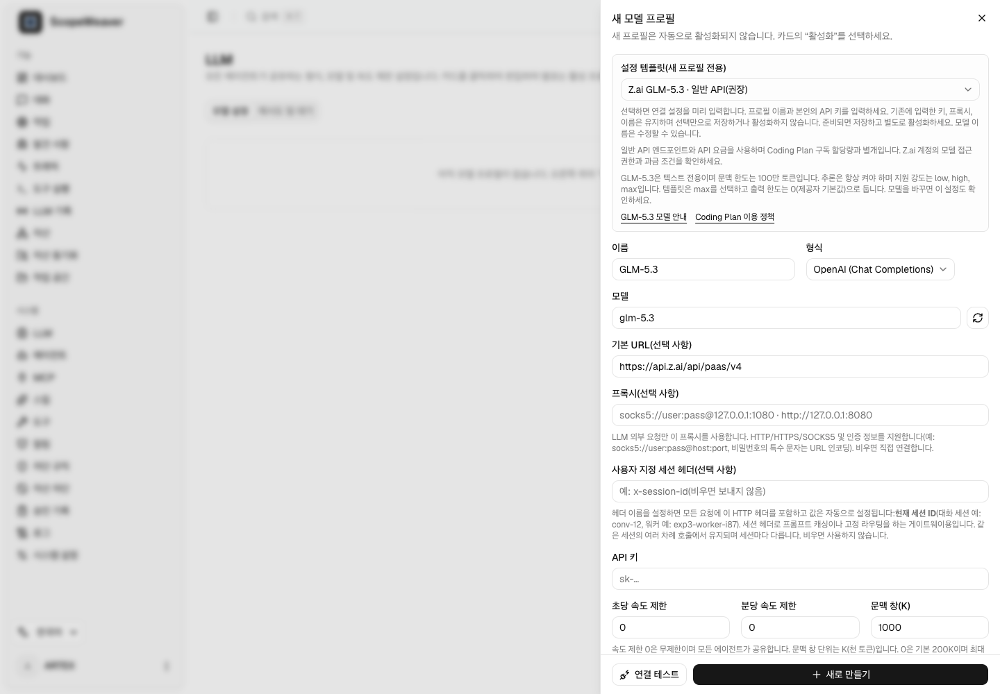

# LLM 제공자 템플릿

ScopeWeaver의 기존 제공자 형식과 기본 URL 설정을 사용합니다. 템플릿은 **새 프로필의 양식만 채우며**, 제공자 호출, 자격 증명 저장, 프로필 활성화 또는 기존 프로필 변경을 수행하지 않습니다.

## Z.ai GLM-5.3

API 키를 입력하지 않은 템플릿 화면이며 실제 제공자 연결 결과가 아닙니다.

**LLM → 새로 만들기 → 설정 템플릿**을 여세요. API 과금에는 **일반 API(권장)**를 선택합니다. **Coding Plan(참고용)**은 ScopeWeaver 사용에 대해 Z.ai의 허가를 받은 경우에만 사용하세요.

| 항목 | 일반 API | Coding Plan 참고용 |
| --- | --- | --- |
| 형식 | OpenAI Chat Completions | OpenAI Chat Completions |
| 기본 URL | `https://api.z.ai/api/paas/v4` | `https://api.z.ai/api/coding/paas/v4` |
| 모델 | `glm-5.3` | `glm-5.3` |
| 추론 | `enabled` | `enabled` |
| 추론 강도 | `max` | `max` |
| 문맥 창(K) | `1000` | `1000` |
| 출력 한도 | `0`(생략, 제공자 기본값) | `0`(생략, 제공자 기본값) |

두 엔드포인트의 과금은 구분됩니다. 일반 API 사용량은 Coding Plan 구독 할당량과 별개입니다. [Z.ai 연결 설정](https://zcode.z.ai/en/docs/configuration)을 참고하고, 테스트 전에 계정의 모델 접근 권한과 과금 조건을 확인하세요.

GLM-5.3은 텍스트 입력과 100만 토큰의 문맥 창을 지원하며 추론을 항상 켜야 합니다. 지원 강도는 `low`, `high`, `max`이며 템플릿은 `max`를 사용합니다. 모델 이름은 수정할 수 있으므로 다른 모델을 선택하면 추론과 문맥 설정도 확인하세요. [공식 GLM-5.3 안내](https://docs.z.ai/guides/llm/glm-5.3)를 참고하세요.

**Coding Plan 지원 범위:** Z.ai는 공식 지원 도구로 사용을 제한하며 ScopeWeaver는 목록에 없습니다. 엔드포인트 템플릿이 사용 허가나 공식 지원을 의미하지는 않습니다. 여기서 사용하려면 먼저 Z.ai의 허가를 받으세요. [도구 연동 안내](https://docs.z.ai/devpack/tool/others)와 [이용 정책](https://docs.z.ai/devpack/usage-policy)을 확인하세요. ScopeWeaver는 지원 도구로 위장하거나 과금 엔드포인트를 자동으로 바꾸지 않습니다.

프로필 이름과 본인의 API 키를 입력하세요. 템플릿을 적용해도 기존에 입력한 이름, 키, 프록시, 세션 헤더 및 관련 없는 설정은 유지합니다. 준비되면 저장하고, 새 프로필은 별도로 활성화하세요. 기존 **연결 테스트**와 **모델 불러오기** 버튼을 클릭하면 실제 제공자 요청이 발생합니다. 이번 변경에서는 실제 제공자 테스트를 수행하지 않았습니다.

공식 문서 확인일: **2026-10-03**. 모델 제공 여부, 계정 권한 및 정책은 바뀔 수 있습니다.

[English guide](../llm-providers.md)
