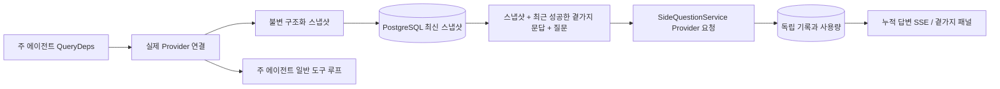

# ScopeWeaver `/btw`

[English](../../../sidequestion/README.md)

일반 대화, 작업 MainAgent, 현재 작업 소속 Worker에서 독립적인 곁가지 질문을 지원합니다. 기본 입력창에 `/btw 질문`을 입력하면 제출하고, 내용 없는 `/btw` 또는 곁가지 질문 버튼은 기록을 엽니다. 데스크톱은 너비 조절 사이드바, 모바일은 Drawer를 사용합니다.

답변은 제출 시점의 에이전트 맥락 스냅샷을 사용하며 스트리밍, 후속 질문, 중지, 비우기를 지원합니다. 패널 닫기, 새로고침, SSE 연결 해제는 모델 요청을 취소하지 않습니다. 중지는 현재 곁가지 질문에만 적용됩니다. 비우기는 요청을 취소하고 곁가지 기록을 삭제하지만 주 맥락 스냅샷은 보존합니다.

## 구현 범위

원본 구현은 Go, norma v0.3.7, Next.js와 기존 Markdown / ResizablePanel / Drawer / AlertDialog를 사용했으며 norma 소스 변경이나 곁가지 기능용 의존성 추가는 없었습니다. Planner, 다른 작업에서 상속한 Worker, 도구형 하위 작업 업그레이드는 범위 밖이었습니다. 이후 의존성 버전은 바뀌었을 수 있습니다.

- `capture.go`는 `Options.Deps.CallModel / CallModelSync`에서만 주 루프 요청을 표시합니다. Provider 데코레이터는 외부 풀 라우팅이 끝난 구체 모델 안에 있어 실제 선택한 모델을 기록합니다. 압축/요약 요청은 스냅샷을 덮어쓰지 않습니다.
- 요청 시작, 전체 모델 응답, 실행 종료 상태에서 스냅샷을 공개합니다. 생성 중 일부 응답은 제외합니다. norma의 `MessagesForAPI`로 도구 호출과 결과를 짝지으며, 결과는 다음 주 모델 요청 또는 종료 상태에서 반영됩니다. 스트리밍 중단 시 마지막 유효 경계를 유지합니다.
- JSON 깊은 복사로 구조화 메시지, 시스템 지침, 도구 정의와 생성 매개변수를 보존합니다. 모델 추론 중 스냅샷 잠금이나 DB 트랜잭션을 유지하지 않습니다.
- `SideQuestionService`는 구체 Provider를 호출하며 필요하면 먼저 요약합니다. 최종 답변은 첫 맥락 초과 오류가 나고 아직 텍스트/도구 호출을 출력하지 않았을 때만 맥락을 줄여 한 번 재시도합니다. 에이전트 세션을 만들지 않고 도구 실행기, 주 transcript, 활동 스트림, 작업 그래프, 작업 모델 전환 체인에 연결하지 않습니다. 기존 구조화 도구 맥락 호환을 위해 답변 요청에는 도구 정의를 유지하지만 요약 요청에는 도구가 없습니다. 새 도구 호출은 실행 경로가 없습니다.
- 부모 세션당 실행 요청 하나, 서비스 프로세스당 최대 네 개이며 제한 시간은 120초입니다. 서비스 수명 아래 독립 취소 맥락을 사용합니다.
- 모델 프로필 참조와 비민감 식별 요약을 보존하고, 요청 시 현재 프로필에서 자격 증명을 읽습니다. 프로필 삭제 또는 모델/프로토콜/주소 등 식별 필드 변경 시 주 에이전트를 실행해 스냅샷을 갱신해야 합니다. 테스트는 제품 기본 모델을 바꾸지 않습니다.

## 저장과 복구

`db/schema.sql`은 `side_question_sessions`와 `side_question_requests`를 만듭니다. 세션에는 부모 리소스, 최신 스냅샷, 실행 ID, 버전, 비우기 버전이 들어갑니다. 요청에는 질문, 누적 답변, 상태, 모델, 스냅샷 시각, 사용량, 이벤트 순번, 페이지 순번이 들어갑니다.

부모 키는 conversation ID 또는 task ID + exploration ID + intent ID입니다. Worker는 재사용 실행 슬롯 이름을 쓰지 않습니다.

스냅샷 쓰기는 부모별로 합쳐 250ms마다 반영합니다. DB는 `(run_id, version)`을 비교해 오래된 쓰기를 막습니다. 곁가지 제출 전에 선택한 스냅샷을 다시 저장합니다. 성공하면 큰 메모리 스냅샷을 해제하고 실패하면 대기 버전을 유지합니다. 누적 스트리밍 답변은 최대 250ms마다 쓰며 종료 상태는 즉시 저장하고 DB 오류 시 제한적으로 재시도합니다.

시작 시 남은 `running` 요청을 `interrupted`로 바꾸고 저장된 일부 답변과 사용량을 유지합니다. 요청을 자동 재실행하지 않습니다. 최근 저장한 맥락으로 다음 질문에 바로 답할 수 있습니다. 스냅샷 없는 예전 세션은 주 에이전트를 먼저 실행해야 하며 UI 활동 기록으로 맥락을 재구성하지 않습니다.

비우기는 비우기 버전을 증가시키고 요청을 삭제합니다. 조건부 갱신은 늦은 콜백을 거부합니다. 부모 물리 삭제는 외래 키 연쇄 삭제를 사용합니다. Worker 논리 삭제는 같은 트랜잭션에서 곁가지 데이터를 지우고 늦은 스냅샷을 거부합니다. 작업 보관은 새 요청 차단, 주 실행 중지 대기, 곁가지 취소 및 저장 대기 순입니다. 보관 형식 v3은 곁가지 테이블 없는 v1/v2도 지원합니다.

전체 기록을 보존하고 순번 커서로 페이지당 최대 20개를 반환합니다. 모델 요청은 성공한 최근 문답 원문 최대 20쌍을 재생하되 토큰 예산으로 더 줄일 수 있습니다. 오래된 문답은 별도 누적 요약에 저장합니다. 주 맥락이 크면 곁가지 복사본의 오래된 부분만 요약하고 최근 구조화 도구 호출/결과는 유지합니다. 요약, 준비, 사용량은 곁가지 동시 실행, 취소, 120초 제한에 함께 포함됩니다. [맥락 예산 및 원본 참고 자료](CONTEXT_BUDGET.md)를 참고하세요.

## HTTP 계약

기존 인증과 리소스 검증을 적용하는 다음 경로가 `{parent}`입니다.

- `/api/conversations/{id}`
- `/api/tasks/{id}/chat`
- `/api/tasks/{id}/intents/{iid}`

| 요청 | 응답과 동작 |
| --- | --- |
| `GET {parent}/side-questions?before={ordinal}` | 최신순 `items`, 독립 실행 상태 `current`, `snapshot` 메타데이터, `next_cursor`; 0은 최신 페이지 / 다음 페이지 없음을 뜻함 |
| `POST {parent}/side-questions` | JSON `{ "question": "…", "client_request_id": "UUID" }`; 신규 요청은 202와 요청 객체, 같은 ID/질문은 기존 객체와 200 |
| `DELETE {parent}/side-questions` | 해당 부모의 곁가지 문답 취소 및 비우기 |
| `GET /api/side-questions/{requestID}/events` | `snapshot` SSE 이벤트: 증가하는 순번 `id`, `data`에 전체 누적 요청 객체; 비우기 시 `cleared` |
| `POST /api/side-questions/{requestID}/cancel` | 명시적 취소; 종료 상태는 기록 또는 SSE로 조회 |

질문은 최대 4000자입니다. 스냅샷 없음, 프로필 변경, 부모가 사용 중, 멱등 ID 충돌은 409이며 전역 동시 실행 한도는 429입니다. SSE 연결마다 누적 상태를 먼저 보내므로 이전 조각 수신 여부에 의존하지 않습니다. 프런트엔드는 요청 ID + 순번으로 합치고 부모 전환이나 비우기 시 이전 콜백을 폐기합니다.

## 검증과 참고

[VALIDATION.md](VALIDATION.md)는 원본의 자동 검사, 실제 모델 사용과 알려진 한계를 기록합니다. 이는 새로운 ScopeWeaver 검증 결과가 아닌 과거 기록입니다.

독립 요청은 [Grok CLI 고정 커밋](https://github.com/superagent-ai/grok-cli/blob/fb97af83f06dca873281d60168430f06c8de6324/src/utils/side-question.ts), 실행 격리는 [OpenCode 고정 커밋](https://github.com/anomalyco/opencode/tree/b3f1a96c6dd7adeb28b36dd11add1998fc84d67b)을 참고했습니다. ARTEX는 프런트엔드 로그로 텍스트를 재조합하지 않고 norma 구조화 메시지를 사용했으며 ScopeWeaver도 이를 유지합니다.
