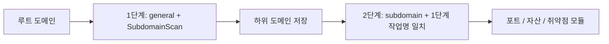

# ScopeSentry MCP 사용 안내

배포된 ScopeSentry 인스턴스용 안내입니다. Cursor 또는 다른 MCP 클라이언트로 연결하며 로컬 소스는 필요하지 않습니다. [English](../../../skills/scopesentry/SKILL.md)

## 1. 준비

### 1.1 서비스 접근 확인

- 기본 웹 화면: `http://<host>`
- MCP 주소: `http://<host>/mcp`. 역방향/프런트엔드 프록시가 있으면 실제 `/mcp` 주소를 사용하세요.

### 1.2 API 키 생성

1. ScopeSentry 웹 화면에 로그인합니다.
2. API Key 관리 화면 또는 관리자가 제공한 API에서 키를 생성합니다.
3. 반환된 `ssk_...` 문자열을 저장합니다. 한 번만 표시됩니다.

### 1.3 Cursor MCP 설정

Cursor에서 Settings → MCP → Add server를 엽니다:

```json
{
  "mcpServers": {
    "scopesentry": {
      "url": "http://<your-host>:8082/mcp",
      "headers": {"X-API-Key": "ssk_your-key"}
    }
  }
}
```

`Authorization: Bearer ssk_your-key`도 사용할 수 있습니다. MCP를 재시작하거나 Cursor를 다시 불러온 뒤 `list_projects`, `list_assets` 등이 보이는지 확인하세요.

## 2. 도구

| 도구 | 용도 |
| --- | --- |
| `list_projects` | 태그별 프로젝트 트리와 ID |
| `list_projects_data` | 이름 검색 가능한 프로젝트 페이지 목록 |
| `get_project` | 프로젝트 상세 |
| `create_project` | 프로젝트 생성 |
| `list_tasks` | 스캔 작업 목록 |
| `get_task` | 작업 상세 |
| `list_scan_templates` | 스캔 템플릿 목록 |
| `get_scan_template` | 템플릿 상세 |
| `list_plugin_modules` | 스캔 파이프라인 모듈 이름 |
| `list_plugins` | 사용 가능한 플러그인, 해시, 기본 매개변수 |
| `create_scan_template` | 스캔 템플릿 생성 |
| `create_scan_task` | 스캔 작업 생성 |
| `list_assets` | 페이지별 자산 조회 |
| `count_assets` | 자산 수 (`/api/assets/common/total`) |
| `get_asset_detail` | 자산 또는 취약점 상세 |
| `add_asset_tag` | 자산 태그 추가 |
| `list_nodes` | 스캔 노드 목록 |

매개변수는 MCP 도구 스키마를 기준으로 합니다. `list_assets`와 `count_assets`는 검색/필터 문법을 공유하므로 조회 전에 `list_assets` 설명을 읽으세요. 전체 개수는 모든 페이지를 읽지 말고 웹 페이지 합계 API에 대응하는 `count_assets`를 사용합니다.

## 3. 일반 작업 흐름

### 3.1 프로젝트별 자산 조회

사용자나 맥락에 프로젝트가 지정되어 있으면 `filter.project`로 범위를 좁혀 느린 전체 조회를 피합니다. 프로젝트를 모르면 필터를 강제하지 않습니다.

1. `list_projects` 또는 `list_projects_data`로 프로젝트 ObjectID(`id` / `children[].value`)를 얻습니다.
2. `list_assets.filter.project`에는 표시 이름이 아닌 해당 ID를 넣습니다.

```json
{
  "asset_type": "asset",
  "pageIndex": 1,
  "pageSize": 20,
  "search": "domain=^example.com",
  "filter": {"project": ["<project-ObjectID>"]}
}
```

### 3.2 스캔 작업 생성

1. `list_nodes`로 온라인 노드 이름을 얻습니다.
2. `list_scan_templates` 또는 `create_scan_template`로 템플릿 ObjectID를 얻습니다.
3. `create_scan_task`에는 `name`, `node`가 필수이며 `template`은 이름이 아닌 ID입니다.

`targetSource`는 웹 화면과 같습니다:

| targetSource | 원본 | 필수 매개변수 |
| --- | --- | --- |
| `general` | 직접 입력 | `target` |
| `project` | 프로젝트 대상 | `project` (ObjectID 배열) |
| `asset` | 웹 자산 DB 검색 | `search`; 선택 `project`, `filter`, `targetNumber` |
| `RootDomain` | 루트 도메인 DB 검색 | `search`; 선택 `project`, `filter`, `targetNumber` |
| `subdomain` | 하위 도메인 DB 검색 | `search`; 선택 `project`, `filter`, `targetNumber` |
| `UrlScan` | URL 스캔 결과 검색 | `search`; 선택 `project`, `filter`, `targetNumber` |
| `*Source`, 예: `subdomainSource` | 자산 화면 선택/검색 | `targetTp=search`는 `search`, `targetTp=select`는 `targetIds` |

루트 도메인 직접 스캔:

```json
{
  "name": "example-subdomain-discovery",
  "node": ["node-1"],
  "template": "<template-ObjectID>",
  "targetSource": "general",
  "target": "example.com\nfoo.com",
  "project": ["<project-ObjectID>"]
}
```

이전 작업 이름으로 하위 도메인을 골라 이어서 스캔:

```json
{
  "name": "example-ports-and-findings",
  "node": ["node-1"],
  "template": "<follow-up-template-ObjectID>",
  "targetSource": "subdomain",
  "search": "task==\"example-subdomain-discovery\"",
  "project": ["<project-ObjectID>"]
}
```

### 3.3 루트 도메인 전체 탐색을 두 단계로 실행

루트 도메인에서 전체 정보를 수집할 때는 두 번 나누어 스캔합니다. 분산 작업은 개별 대상을 노드에 배정합니다. 한 번에 실행하면 루트와 그 하위 도메인의 후속 모듈이 한 노드에 몰려 부하 불균형, 지연, 오류가 생길 수 있습니다.

1. 1단계는 하위 도메인 수집만 수행합니다. `targetSource=general`, 모든 루트를 여러 줄의 `target`으로 넣고 `SubdomainScan`, `SubdomainSecurity`(수집 및 탈취 확인)만 켠 템플릿을 사용합니다. `get_task`로 완료를 기다립니다.
2. 2단계는 후속 모듈입니다. `targetSource=subdomain`, 정확한 `search=task=="<stage-one-task-name>"`와 선택적 `project`를 사용합니다. 포트 스캔, 자산 매핑, 취약점 스캔 템플릿을 사용하며 `SubdomainScan`은 생략할 수 있습니다. 하위 도메인이 독립 대상으로 여러 노드에 분배됩니다.

웹에서는 하위 도메인 자산 화면을 작업 이름으로 필터링한 뒤 하위 도메인으로 작업 만들기를 선택하면 같습니다.



### 3.4 스캔 템플릿 생성

1. `list_plugin_modules`로 모듈 이름을 조회합니다.
2. `list_plugins`는 각 플러그인 `hash`와 기본 `parameter`를 반환하며 `module`로 필터링할 수 있습니다.
3. `create_scan_template`의 `modules`를 모듈 이름 → 플러그인 해시 배열로 지정합니다.

## 4. 자산 조회 (`list_assets` / `count_assets`)

두 도구는 같은 `asset_type`, `search`, `filter`를 사용합니다. `count_assets`는 웹의 `/api/assets/common/total`에 해당하는 `{"total": N}`을 반환합니다.

```json
{
  "asset_type": "subdomain",
  "search": "task==\"task-name\"",
  "filter": {"project": ["<project-ObjectID>"]}
}
```

두 도구 모두 프로젝트를 알면 `filter.project`로 범위를 좁힙니다. 넓은 `=` 정규식보다 인덱스를 사용하는 `==` 일치 또는 `^` 접두사 검색을 우선합니다([4.3](#43-검색-표현식)). 프로젝트 맥락이 없으면 필수 필터가 아닙니다. 지원 형식은 [4.4](#44-정확한-필터)를 참고하세요.

### 4.1 자산 형식

`asset`, `RootDomain`, `subdomain`, `app`, `mp`, `UrlScan`, `SensitiveResult`, `DirScanResult`, `crawler`, `vulnerability`, `PageMonitoring`, `IPAsset`, `SubdomainTakerResult`.

별칭 예: `web` → `asset`, `vuln` → `vulnerability`, `ip` → `IPAsset`, `url` → `UrlScan`.

### 4.2 매개변수

| 매개변수 | 의미 |
| --- | --- |
| `pageIndex` / `pageSize` | 페이지 처리, 기본 1 / 20 |
| `search` | 아래 검색 표현식 |
| `filter` | 아래 정확 필터 JSON |
| `sort` | UrlScan과 DirScanResult만 `length` 정렬 지원 |
| `sid` | SensitiveResult 전용: 민감 규칙 이름 |

`search`와 `filter`를 함께 사용할 수 있습니다.

### 4.3 검색 표현식

SQL이 아닌 전용 DSL입니다.

| 연산자 | 의미 | 인덱스 | 예 |
| --- | --- | --- | --- |
| `=` | 정규식 일치 | 미사용 | `domain=example` |
| `==` | 정확 일치 | 사용 | `port==443` |
| `!=` | 제외 | N/A | `port!="80"` |
| `&&` | AND | N/A | `domain==example.com && port==443` |
| `\|\|` | OR | N/A | `title=admin \|\| body=login` |

`domain`, `ip`, `port`, `title` 등에는 인덱스가 있습니다. 정확한 `==` 또는 `^`로 시작하는 값(예: `domain=^example.com`)만 인덱스를 사용합니다. 일반 `=`는 정규식이 되어 대용량에서 느릴 수 있습니다.

모든 형식에 `tag`, `task`(작업 이름), `rootDomain`을 사용할 수 있습니다. `search`에 `project`를 넣으면 무효이거나 `&&` 결합 시 오류가 나므로 `filter.project`를 사용하세요.

| asset_type | 일반 검색 필드 |
| --- | --- |
| asset | domain, ip, port, service, app, title, statuscode, icon, banner, type, body, header |
| RootDomain | domain, icp, company |
| subdomain | domain, ip, type, value |
| app | name, icp, company, category, description, url, apk |
| mp | name, icp, company, category, description, url |
| UrlScan | url, input, source, resultId, type |
| SensitiveResult | url, sname, body, info, md5 |
| DirScanResult | url, statuscode, redirect, length |
| vulnerability | url, vulname, matched, request, response, level |
| crawler | url, method, body, resultId |
| PageMonitoring | url, hash, diff, response |
| IPAsset | ip, domain, port, service, webServer, app |
| SubdomainTakerResult | domain, value, type, response |

예:

- `domain==www.example.com && port==443`: 인덱스 일치.
- `domain=^example.com`: 인덱스 접두사.
- `ip==192.168.1.1`
- `task=="task-name"`
- `level==high` vulnerability용.
- `statuscode==200` DirScanResult용.

`title=admin`처럼 부분 문자열/정규식이 필요할 때만 `=`를 사용합니다. 인덱스를 사용하지 않으므로 프로젝트 등 다른 조건으로 좁히세요.

### 4.4 정확한 필터

`filter`는 JSON 객체입니다. 같은 키의 여러 값은 OR, 다른 키는 AND입니다. 프로젝트를 알고 해당 형식이 지원하면 `project`를 포함하며 그 외에는 선택 사항입니다.

| 필터 키 | 의미 | 값 |
| --- | --- | --- |
| `project` | 소속 프로젝트 | `list_projects` / `list_projects_data`의 ObjectID |
| `task` | 원본 작업 | `list_tasks.name`의 작업 이름 |
| `port` | 포트 | 예: `"443"` |
| `service` | 서비스/프로토콜 | 예: `"https"` |
| `app` | 앱 지문 | 예: `"Nginx"` |
| `icon` | 아이콘 해시 | |
| `statuscode` | HTTP 상태 | 주로 asset |
| `status` | 상태 | UrlScan/DirScan HTTP 코드; 취약점/민감 정보 처리 상태 |
| `level` | 취약점 심각도 | critical / high / medium / low / info |
| `type` | 형식 | 예: A / CNAME 하위 도메인 레코드 |
| `color` | 민감 규칙 색상 | SensitiveResult |
| `sname` | 민감 규칙 이름 | SensitiveResult |
| `tags` | 태그 | |

| asset_type | 지원 필터 키 |
| --- | --- |
| asset | project, port, service, app, icon, statuscode, type, task, tags |
| RootDomain | project, tags |
| subdomain | project, type, task, tags |
| app / mp | project, tags |
| UrlScan | status, tags |
| DirScanResult | status, tags |
| SensitiveResult | status, color, sname, tags |
| crawler | project, task, tags |
| vulnerability | project, level, status, task, tags |
| PageMonitoring / SubdomainTakerResult | tags |
| IPAsset | project, port, service, app |

필터 예:

```json
{"project": ["<project-ObjectID>"], "port": ["443"]}
```

결합 조회:

```json
{
  "asset_type": "asset",
  "search": "domain=^baidu && port==443",
  "filter": {"project": ["<project-ObjectID>"]},
  "pageIndex": 1,
  "pageSize": 10
}
```

주의 사항:

- 프로젝트를 알고 지원하면 `filter.project`를 포함하되 맥락을 추측하지 않습니다.
- `filter.project`에 프로젝트 표시 이름을 넣지 않습니다.
- 알려진 값은 `==`, 접두사는 `^`를 사용하며 큰 테이블의 넓은 `=` 조회를 피합니다.
- UrlScan HTTP 상태는 `filter.status`, DirScanResult는 검색에서 `statuscode==200`을 사용할 수 있습니다.
- SensitiveResult 규칙 이름은 검색의 `sname=rule-name` 또는 `filter.sname`을 사용합니다.

### 4.5 정렬

UrlScan과 DirScanResult만 다음을 지원합니다:

```json
{"length": "ascending"}
```

다른 형식은 `sort`를 무시하고 기본 시간 정렬을 사용합니다.

## 5. 스캔 템플릿 모듈

`TargetHandler`, `SubdomainScan`, `SubdomainSecurity`, `PortScanPreparation`, `PortScan`, `PortFingerprint`, `AssetMapping`, `AssetHandle`, `URLScan`, `WebCrawler`, `URLSecurity`, `DirScan`, `VulnerabilityScan`, `PassiveScan`.

## 6. 문제 해결

| 증상 | 조치 |
| --- | --- |
| MCP 도구 없음 | URL, API 키, ScopeSentry 실행 상태 확인 |
| 401 / 403 | API 키 재생성 또는 교체 |
| 자산 조회 안 됨 | 프로젝트 ObjectID 확인; search에서 project 제외 |
| 템플릿/작업 생성 실패 | `template`은 ObjectID, `node`는 온라인 노드 이름이어야 함 |
| 느리거나 멈춘 조회 | 프로젝트 필터, 인덱스 `==`/`^` 사용, `=` 제한, `pageSize` 축소 |
