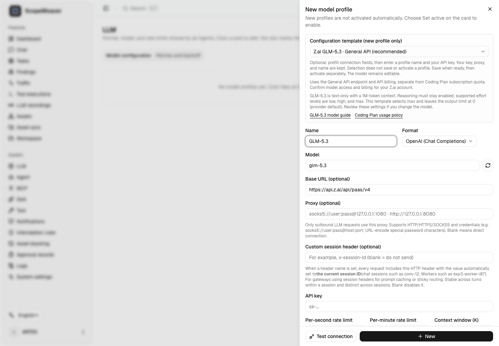

# LLM provider templates

ScopeWeaver uses its existing provider formats and custom base URL fields. A template only fills a **new profile's form**; it does not contact a provider, save credentials, activate a profile, or modify existing profiles.

## Z.ai GLM-5.3

Template preview with no API key entered; this is not a live provider connection.

Open **LLM → New → Configuration template**. Choose **General API (recommended)** for API billing, or **Coding Plan (reference)** only after obtaining Z.ai authorization for ScopeWeaver.

| Field | General API | Coding Plan reference |
| --- | --- | --- |
| Format | OpenAI Chat Completions | OpenAI Chat Completions |
| Base URL | `https://api.z.ai/api/paas/v4` | `https://api.z.ai/api/coding/paas/v4` |
| Model | `glm-5.3` | `glm-5.3` |
| Thinking | `enabled` | `enabled` |
| Reasoning effort | `max` | `max` |
| Context window (K) | `1000` | `1000` |
| Output limit | `0` (omit; provider default) | `0` (omit; provider default) |

The endpoints and billing are distinct: General API usage is separate from Coding Plan subscription quota. See [Z.ai connection configuration](https://zcode.z.ai/en/docs/configuration). Confirm your account's model access and billing before testing.

GLM-5.3 accepts text, has a 1M-token context window, and requires reasoning to remain enabled. Supported effort values are `low`, `high`, and `max`; this template uses `max`. The model field remains editable, so review reasoning and context settings when choosing another model. See the [official GLM-5.3 guide](https://docs.z.ai/guides/llm/glm-5.3).

**Coding Plan support boundary:** Z.ai limits Coding Plan to officially supported tools. ScopeWeaver is not on that list; an endpoint template does not establish permission or support. Obtain Z.ai authorization before using it here. See [tool integration](https://docs.z.ai/devpack/tool/others) and [usage policy](https://docs.z.ai/devpack/usage-policy). ScopeWeaver does not impersonate supported tools or switch billing endpoints automatically.

Enter a profile name and your own API key. Applying either template preserves any name, key, proxy, session-header setting, and other unrelated preferences already entered. Save when ready; a new profile must be activated separately. The existing **Test connection** and **Load models** controls make real provider requests only when clicked; this change does not perform a live provider test.

Verified against official documentation on **2026-10-03**. Provider availability, account entitlement, and policies may change.

[한국어 안내](ko/llm-providers.md)
